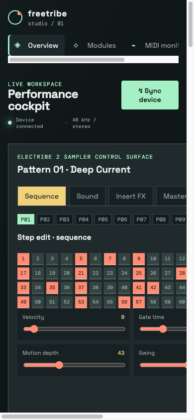
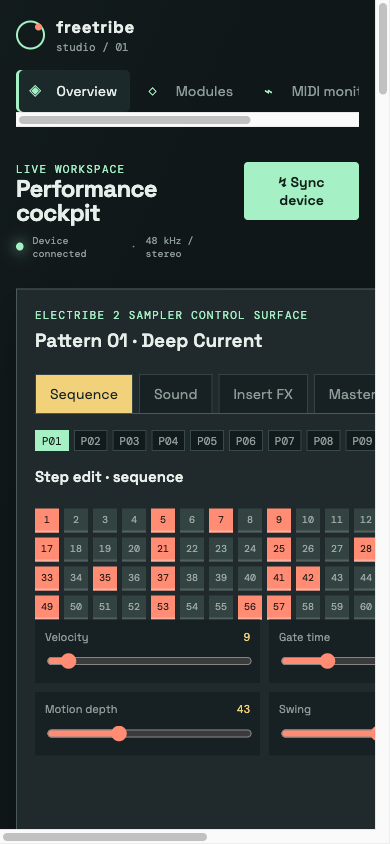

# Freetribe Studio

Freetribe Studio is a community fork of [Freetribe](https://github.com/bangcorrupt/freetribe) with a browser-based control surface for Electribe 2 experiments, patch design, MIDI routing, and audio module development.

It keeps the upstream firmware and history, then adds a practical companion UI for exploring the instrument from a desktop browser. The UI works without a build step; an optional Node.js bridge adds macOS plugin discovery and Audio Unit probing.



## What is included

### Studio workspace

- Electribe 2-style 16-part control surface with Sequence, Sound, Insert FX, Master FX, Global, and Data Utility pages
- 64-step part editor with per-step MIDI output
- 16-step pattern sequencer with tempo, transport, clock source, reset, and randomize controls
- Live signal meters, DSP load, buffer status, event log, and MIDI monitor
- Module selection for Monosynth, Attenuate, and Zontar workflows

### MIDI and patches

- Virtual keyboard with note event monitoring
- Optional Web MIDI input and output in browsers that support it
- Parameter mapping for Electribe 2 controls with MIDI Learn
- JSON import and export for patches and MIDI maps
- Local browser storage for saved patches
- Standard MIDI file import into the current pattern

### Samples and sound design

- WAV, AIFF, and MP3 import with waveform preview
- Multi-sample library with slots 501-999, metadata, audition, selection, bulk delete, and manifest export
- Beat-pad programming against the current pattern
- Non-destructive sample editor with trim, loop, pitch, gain, and low-pass preview controls
- Original `e2sSample.all` byte-preserving import and download

### Native companion

- macOS discovery for VST3, VST2, and Audio Unit bundles in standard user and system plugin folders
- Browser DSP fallback when no native plugin bridge is available
- Optional Audio Unit probe for checking whether installed units can be instantiated
- Roadmap and device-sync simulation surfaces for planning future hardware integration



## Quick start

### Browser-only mode

Requirements: Python 3, or any static HTTP server.

```sh
python3 -m http.server 8080 --directory ui
```

Open <http://localhost:8080>. This mode includes the full UI, local patch storage, sample tools, pattern editing, and Web MIDI where the browser permits it. It does not provide native plugin discovery.

### macOS companion mode

Requirements: macOS, Node.js 18 or newer, and `swiftc` only if Audio Unit probing is needed.

```sh
npm run studio
```

Open <http://localhost:8080>. The native companion serves the same UI and exposes `/api/plugins` for plugin discovery.

To build and run the optional Audio Unit probe:

```sh
npm run probe:audio-units
```

Use **Scan user system** in the Plugin processing bridge. VST processing still requires a host SDK bridge; Audio Unit probing verifies availability but does not replace a production host.

To use another port:

```sh
PORT=8090 npm run studio
```

## Browser support

The core Studio UI works in current desktop and mobile browsers. Web MIDI requires a browser that exposes `navigator.requestMIDIAccess`, typically Chrome or Edge with permission granted. Screen recording requires `getDisplayMedia` and downloads a WebM file when stopped. Audio decoding and preview depend on the browser's Web Audio implementation.

## Repository layout

| Path | Purpose |
| --- | --- |
| `ui/index.html` | Dependency-free Studio interface and client behavior |
| `ui/server.mjs` | Node.js static server and macOS plugin APIs |
| `native/AudioUnitProbe.swift` | Optional Audio Unit inspection utility |
| `ELECTRIBE_2_SAMPLER_RESEARCH.md` | Verified controller research and feature boundaries |
| `cpu/` | Upstream Electribe CPU firmware and kernel code |
| `dsp/` | Upstream Blackfin DSP code and modules |

## Project status

The companion is an exploration and control surface, not a replacement firmware or a finished DAW plugin host. Hardware sync, USB, SD, high-speed DSP transport, native VST hosting, and binary `.all` creation remain separate engineering projects. Imported `.all` files are preserved byte-for-byte; WAV uploads remain browser samples and are not mislabeled as Korg libraries.

## Contributing

Open an issue or pull request with a focused change. For Studio work, include reproduction steps and browser or macOS version details when behavior depends on platform APIs. Firmware changes that are broadly useful should also be proposed to the upstream project.

## Credit and lineage

This repository is a fork of [bangcorrupt/freetribe](https://github.com/bangcorrupt/freetribe), which provides the original Electribe 2 firmware work, hardware research, API, kernel, DSP foundation, and project history. Please use the upstream repository for its original authorship, discussions, and sponsorship links.

The upstream project acknowledges these open-source foundations:

- [StarterWare](https://www.ti.com/tool/STARTERWARE-SITARA) by Texas Instruments for CPU driver foundations
- [monome/aleph](https://github.com/monome/aleph) for DSP initialization, peripherals, and the public-domain DSP library
- [mikromodular/libmidi](https://github.com/mikromodular/libmidi) for MIDI input parsing
- [Arduino MIDI Library](https://github.com/FortySevenEffects/arduino_midi_library) for SysEx and binary conversion references
- [UGUI](https://github.com/deividAlfa/UGUI) and [micromenu](https://github.com/abcminiuser/micromenu-v2) for embedded UI foundations

Freetribe Studio retains the upstream AGPL-3.0 license. See [LICENSE](LICENSE).
